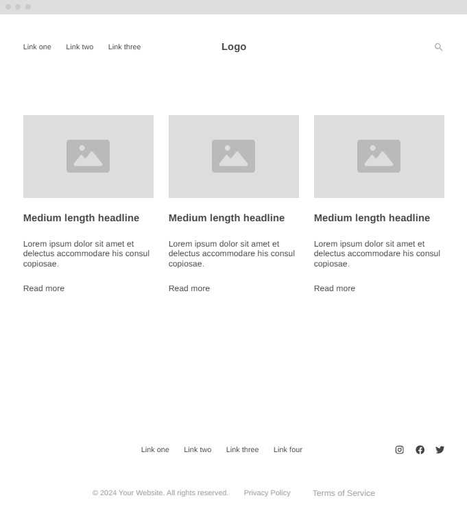
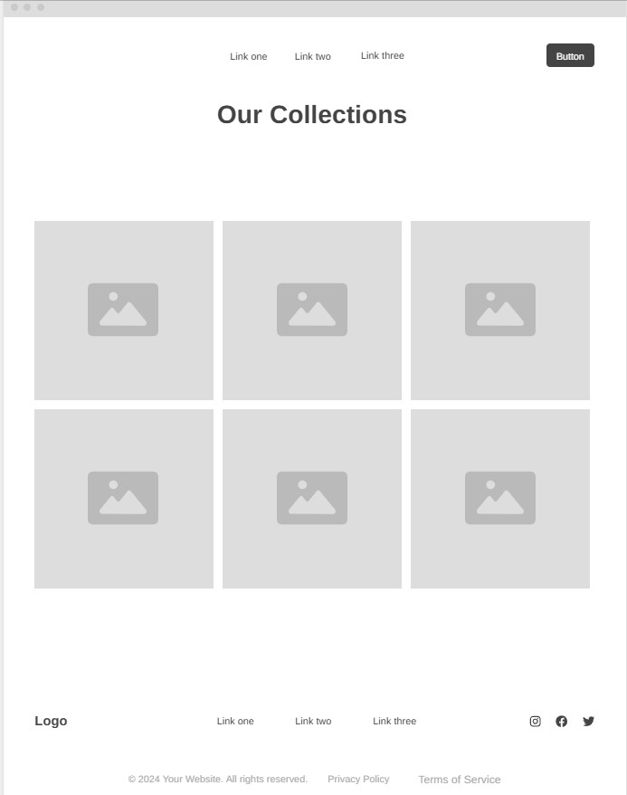
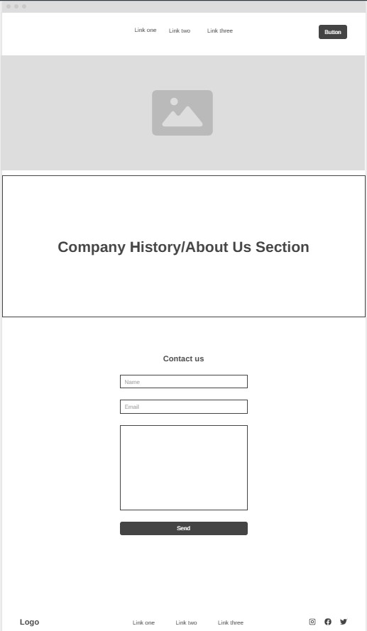

# Alexis Currie's INF 6420 Project

*A website for a fictional secondhand bookshop to display inventory for their brick and mortar location.*

## Wireframes

### Landing Page

**Header** - will contain the logo for the bookshop, links to the collection and about us/contact pages, a search button.

**Main Content** - will contain images of recent acquisitions for the bookshop and information about the books.

**Footer** - will contain links to the other pages as well as the social media sites for bookshop.

### Inventory Page

**Header** - will contain links to the other pages and a search button.

**Main Content** - will contain images and information for all of the books in the shops inventory as well as prices.

**Footer** - will contain the logo for the bookshop, links to the other pages, and social media links.

### About/Contact Page

**Header** - will contain links to the other pages and a search button.

**Main Content** - will contain an image of the bookshops storefront, the company history for the bookshop, and a form for patrons to email the bookshop about inventory inquiries.

**Footer** - will contain the logo for the bookshop, links to the other pages, and social media links.